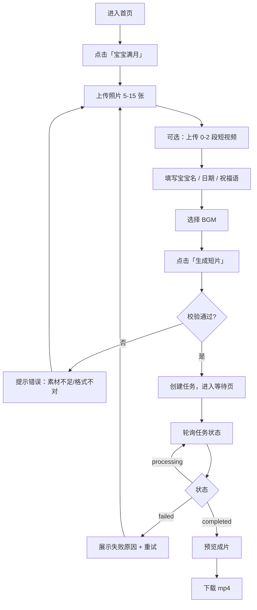
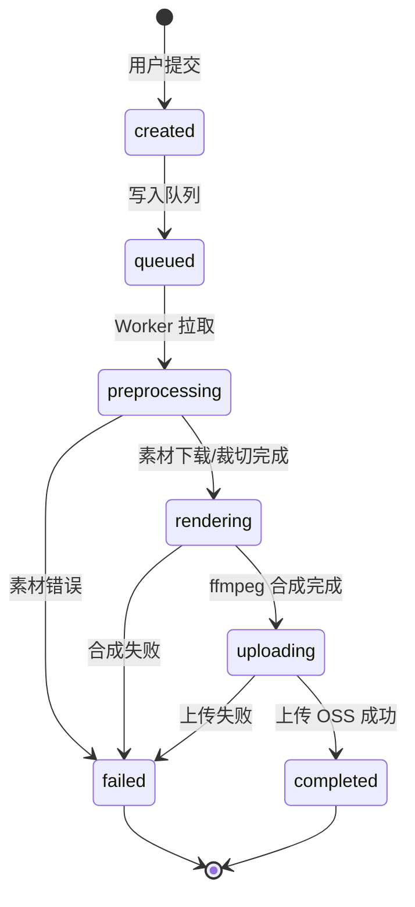

# MVP 开工包：宝宝满月纪念短片

> 项目名称：`life-video-mvp`（代码目录：`../life-video-mvp/`）  
> 模板路线：**先做满月模板（照片多、片长自然变长）→ 再做结婚纪念短片**（第二版）。  
> 配套总方案：[生活场景 AI 短片工具 — 全链路方案](./生活场景AI短片工具-全链路方案.md)

---

## 使用说明

| 阶段 | 做什么 | 预计时间 |
|------|--------|----------|
| Day 1 | 读本文「范围 + 流程 + 模板」；访谈 1 个朋友 | 2～3 小时 |
| Day 2 | 本地 ffmpeg 出第一条成片；建仓库 | 半天 |
| Day 3～7 | 按「第一周任务清单」纵向打通 | 每天 1～2 小时 |

**原则：文档服务于开工，第 3 天必须开始写代码。**

---

## 一、一页纸 PRD

### 1.1 产品一句话

帮家长上传宝宝照片和短视频，选模板、填信息、选音乐，**一键生成满月纪念短片**并下载。片长不固定：**照片越多越长**，有视频再叠加一段（见 [4.4 时长规则](#44-时长规则)）。

### 1.2 给谁用

- 主要用户：宝宝满月家庭（你的朋友、朋友圈有类似需求的人）
- 使用场景：发朋友圈、家庭群、满月宴现场播放

### 1.3 第一版做什么（In Scope）

| 功能 | 说明 |
|------|------|
| 选模板 | 仅「宝宝满月」（时长随素材计算） |
| 上传素材 | 5～15 张照片 + 0～2 段短视频（可选） |
| 填写信息 | 宝宝昵称、满月日期、一句祝福语 |
| 选择 BGM | 内置 3 首（温馨钢琴/轻柔吉他/童谣风） |
| 一键生成 | 提交后异步合成，展示进度 |
| 预览下载 | 生成完成后在线预览 + 下载 mp4 |

### 1.4 第一版不做什么（Out of Scope）

- ❌ 自由时间轴剪辑（剪映 Pro 级）
- ❌ 第二个模板（结婚纪念）— 满月跑通全链路后再做
- ❌ 用户登录 / 支付 — 先用匿名 + 每日次数限制
- ❌ AI 文生视频 / 即梦类空镜 — 第二版可选
- ❌ 微信小程序 — 先做 Web
- ❌ 复杂字幕编辑器 — 只用模板固定样式

### 1.5 素材规则

| 类型 | 数量 | 格式 | 大小限制 |
|------|------|------|----------|
| 照片 | 5～15 张 | JPG、PNG、WEBP | 单张 < 10MB |
| 视频 | 0～2 段 | MP4、MOV | 单段 < 100MB，建议 < 30 秒/段 |
| 成片 | 1 条 | MP4 | **随素材计算**（常见 40～70 秒，见 4.4），竖屏 **720×1280**（9:16） |

**MVP 定案：固定竖屏 720×1280**（9:16），够发朋友圈、合成快；高清 **1080×1920** 留作后续选项。

### 1.6 成功标准（第一版完成的定义）

- [ ] 本地：用脚本 + 模板 JSON 能生成竖屏 mp4（时长符合 4.4 规则）
- [ ] 线上：用户从网页上传 → 等进度 → 下载到成片
- [ ] 质量：朋友看了觉得「能发」，不是内部 demo 水平
- [ ] 稳定：连续生成 3 次，至少 2 次成功

### 1.7 非目标（别在第一周纠结）

- 成片美学极致、转场花样多
- 多语言、多主题皮肤
- 商业化定价

---

## 二、用户流程图

### 2.1 主流程



### 2.2 页面清单（MVP 共 4 页）

| 页面 | 路径建议 | 作用 |
|------|----------|------|
| 首页 | `/` | 介绍 + 进入「宝宝满月」 |
| 创作页 | `/create/baby-moon` | 上传 + 表单 + 提交 |
| 等待页 | `/jobs/[id]` | 进度、预计时间、失败重试 |
| 结果页 | 可合并到等待页 | 预览播放器 + 下载按钮 |

---

## 三、任务状态机



### 状态与前端展示

| 状态 | 用户看到的文案 | 进度条建议 |
|------|----------------|------------|
| created / queued | 排队中，请稍候… | 10% |
| preprocessing | 正在处理素材… | 30% |
| rendering | 正在合成短片… | 60% |
| uploading | 即将完成… | 90% |
| completed | 生成成功 | 100% |
| failed | 生成失败，请重试 | — |

---

## 四、模板时间轴（核心资产）

### 4.1 时间轴说明（满月 · 竖屏 · 结构固定、时长随素材走）

```text
┌─────────────────────────────────────────────────────────────┐
│ 开头    标题卡：宝宝昵称 + 「满月快乐」+ 日期        固定 5s │
│ 中段    照片轮播：每张照片 2.8s，淡入淡出            张数 × 2.8s │
│ 可选    视频片段：有则插入，每段最多 5s，最多 2 段    0～10s │
│ 结尾    祝福语 + BGM 渐出                            固定 5s │
└─────────────────────────────────────────────────────────────┘

朋友典型场景（照片多）：
  10 张照片、无视频  → 约 38s
  15 张照片、无视频  → 约 52s
  15 张照片 + 2 段视频 → 约 62s

下限（仅 5 张、无视频）→ 约 24s，偏短但可接受；真实用户多半会传更多张。
```

**定案：不凑时长、不砍照片。** 每张约 3 秒，用户传多少算多少。创作页展示「预计约 XX 秒」即可。

### 4.2 模板 JSON（Worker 直接读取）

```json
{
  "id": "baby_full_moon_v1",
  "name": "宝宝满月纪念",
  "version": "1.0.0",
  "output": {
    "width": 720,
    "height": 1280,
    "fps": 30,
    "durationMode": "computed",
    "format": "mp4",
    "videoCodec": "h264",
    "audioCodec": "aac"
  },
  "segments": [
    {
      "id": "intro",
      "type": "title_card",
      "start": 0,
      "duration": 5,
      "style": {
        "backgroundColor": "#FFF5F5",
        "titleTemplate": "{babyName}",
        "subtitleTemplate": "满月快乐",
        "dateTemplate": "{eventDate}",
        "fontFamily": "NotoSansSC-Medium"
      }
    },
    {
      "id": "slideshow",
      "type": "photo_slideshow",
      "start": 5,
      "duration": 40,
      "style": {
        "photoDuration": 2.8,
        "transition": "fade",
        "transitionDuration": 0.5,
        "fit": "cover",
        "kenBurns": false
      },
      "source": "photos"
    },
    {
      "id": "video_clips",
      "type": "video_clips",
      "start": 45,
      "duration": 10,
      "optional": true,
      "style": {
        "fit": "cover",
        "maxClips": 2,
        "clipMaxDuration": 5
      },
      "source": "videos"
    },
    {
      "id": "ending",
      "type": "ending_card",
      "start": 55,
      "duration": 5,
      "style": {
        "backgroundColor": "#FFF5F5",
        "textTemplate": "{blessing}",
        "defaultBlessing": "健康成长，平安喜乐"
      }
    }
  ],
  "audio": {
    "bgm": {
      "source": "preset",
      "presets": ["warm_piano", "soft_guitar", "lullaby"],
      "volume": 0.8,
      "fadeIn": 1,
      "fadeOut": 2
    }
  },
  "formFields": [
    { "key": "babyName", "label": "宝宝昵称", "required": true, "maxLength": 20 },
    { "key": "eventDate", "label": "满月日期", "required": true, "type": "date" },
    { "key": "blessing", "label": "祝福语", "required": false, "maxLength": 50 }
  ],
  "constraints": {
    "photos": { "min": 5, "max": 15 },
    "videos": { "min": 0, "max": 2 }
  }
}
```

### 4.3 保存位置建议

```text
life-video-mvp/
  templates/
    baby_full_moon_v1.json    # 上面的 JSON
  assets/
    bgm/
      warm_piano.mp3
      soft_guitar.mp3
      lullaby.mp3
    fonts/
      NotoSansSC-Medium.otf
```

### 4.4 时长规则（定案）

**原则：每张照约 3 秒，有几张算几张；有视频就加上去。** 不做凑满 60 秒、不重复轮播、不丢照片。

#### 计算公式

```text
总时长 = 开头(5s) + 照片数 × 2.8s + 视频时长(0～10s) + 结尾(5s)
```

- **每张照片**：固定 **2.8s**（约 3 秒，观感自然）
- **视频**：用户传了就算，每段最多 5s，最多 2 段；**没传就不加这段**，也不拿照片去填
- **BGM**：按成片实际时长铺，末尾 2s 渐出（`fadeOut`）

#### 前端

用户选完素材后显示精确预估，例如：

```text
预计成片约 52 秒（15 张照片）
```

#### 和 Day 2 的关系

Day 2 曾临时把 5 张各拉 12s 凑 60s，只为验证 ffmpeg。**正式逻辑就是上面的公式。**

---

## 五、技术草图

### 5.1 架构（MVP）

```text
┌──────────────┐     ┌──────────────┐     ┌──────────────┐
│  Next.js     │────▶│  API         │────▶│  Redis       │
│  前端        │     │  (Route/API) │     │  队列        │
└──────────────┘     └──────┬───────┘     └──────┬───────┘
                            │                     │
                            ▼                     ▼
                     ┌──────────────┐     ┌──────────────┐
                     │  PostgreSQL  │     │  Python      │
                     │  任务/元数据  │     │  Worker      │
                     └──────────────┘     │  ffmpeg      │
                                          └──────┬───────┘
                                                 ▼
                                          ┌──────────────┐
                                          │  本地/OSS    │
                                          │  素材+成片   │
                                          └──────────────┘
```

### 5.2 技术栈

| 层级 | 选型 | 备注 |
|------|------|------|
| 前端 | Next.js 14+ App Router + TypeScript | 你熟悉 React |
| API | Next.js Route Handlers 或 NestJS | **第一周用 Next 全栈即可** |
| 数据库 | PostgreSQL + Prisma | 本地 Docker |
| 队列 | Redis + BullMQ | 或先用 DB 轮询凑合 Day3，Day4 上队列 |
| Worker | Python 3.11 + ffmpeg | 合成逻辑放这里 |
| 存储 | 第一周本地磁盘；第二周 OSS | 先跑通再云化 |
| 部署 | 本地 → 一台 ECS | 第二周 |

### 5.3 目录结构（建议）

```text
life-video-mvp/
├── apps/
│   └── web/                 # Next.js
│       ├── app/
│       │   ├── page.tsx
│       │   ├── create/baby-moon/page.tsx
│       │   ├── jobs/[id]/page.tsx
│       │   └── api/
│       │       ├── jobs/route.ts
│       │       └── jobs/[id]/route.ts
│       └── prisma/
│           └── schema.prisma
├── worker/
│   ├── main.py              # 消费队列
│   ├── render.py            # 调用 ffmpeg
│   └── requirements.txt
├── templates/
│   └── baby_full_moon_v1.json
├── assets/
│   ├── bgm/
│   └── fonts/
├── storage/                 # 本地素材与成片（gitignore）
├── docker-compose.yml       # postgres + redis
└── docs/
    └── mvp-满月短片-开工包.md
```

---

## 六、数据表草稿

```prisma
// prisma/schema.prisma 草案

model Job {
  id          String   @id @default(cuid())
  templateId  String   @default("baby_full_moon_v1")
  status      String   @default("created") // created|queued|preprocessing|rendering|uploading|completed|failed
  progress    Int      @default(0)
  errorMsg    String?

  babyName    String
  eventDate   String
  blessing    String?
  bgmPreset   String   @default("warm_piano")

  outputUrl   String?
  outputPath  String?

  createdAt   DateTime @default(now())
  updatedAt   DateTime @updatedAt

  assets      JobAsset[]
}

model JobAsset {
  id        String   @id @default(cuid())
  jobId     String
  job       Job      @relation(fields: [jobId], references: [id], onDelete: Cascade)
  type      String   // photo | video
  fileName  String
  filePath  String   // 本地路径或 OSS key
  sortOrder Int      @default(0)
  createdAt DateTime @default(now())
}
```

**第一周可不建 users 表**，用 IP 或简单 token 限流即可。

---

## 七、API 清单（MVP）

| 方法 | 路径 | 作用 |
|------|------|------|
| POST | `/api/jobs` | 创建任务（multipart：照片/视频 + 表单字段） |
| GET | `/api/jobs/:id` | 查询状态、进度、成片 URL |
| GET | `/api/templates/baby-moon` | 返回模板元信息（可选，也可前端写死） |

### POST `/api/jobs` 请求体（示意）

```text
Content-Type: multipart/form-data

babyName: 小糯米
eventDate: 2026-05-20
blessing: 健康成长
bgmPreset: warm_piano
photos[]: file × N
videos[]: file × 0~2
```

### GET `/api/jobs/:id` 响应（示意）

```json
{
  "id": "clx...",
  "status": "rendering",
  "progress": 60,
  "outputUrl": null,
  "errorMsg": null,
  "createdAt": "2026-06-23T10:00:00Z"
}
```

---

## 八、Day 2 必做：本地 ffmpeg 验证

在写任何前后端之前，先证明 **竖屏 mp4 能拼出来**（时长按 [4.4](#44-时长规则) 或 Day 2 简化版均可）。

### 8.1 环境准备

```bash
# macOS
brew install ffmpeg

# 验证
ffmpeg -version
```

### 8.2 准备测试素材

```text
test-assets/
  photos/   # 放 5 张 JPG
  bgm/warm_piano.mp3
```

### 8.3 最小验证步骤（手工版）

**Step 1：把照片变成统一尺寸竖屏图**

```bash
# 示例：单张缩放裁剪到 720x1280
ffmpeg -i photo1.jpg -vf "scale=720:1280:force_original_aspect_ratio=increase,crop=720:1280" -y out1.jpg
```

**Step 2：用 concat + xfade 做照片轮播（或先用简单 concat demuxer）**

可先简化：**每张图 3 秒静态视频，再 concat**，不追求转场完美。

```bash
# 单张图 3 秒
ffmpeg -loop 1 -i out1.jpg -t 3 -vf "scale=720:1280" -pix_fmt yuv420p -y seg1.mp4
# 对 seg2..segN 重复，再 concat
```

**Step 3：加 BGM**

```bash
ffmpeg -i slideshow.mp4 -i bgm/warm_piano.mp3 -c:v copy -c:a aac -shortest -y final.mp4
```

### 8.4 通过标准

- [ ] 输出 `final.mp4` 竖屏 **720×1280**，手机能播放
- [ ] 有背景音乐，音量正常
- [ ] 时长按 **4.4** 计算（5 张 × 2.8s ≈ 14s 轮播段；加头尾卡后约 24s），不凑固定 60s

通过后，命令已封装进 `worker/render.py`。

---

## 九、第一周任务清单（按天）

### Day 1 — 想清楚（今天）

- [ ] 读完本文档
- [ ] 微信问 1 个朋友：满月片最在意什么（音乐/字幕/照片顺序）
- [ ] 确认竖屏 720×1280
- [ ] 下载 3 首无版权 BGM 到 `assets/bgm/`（可用 Pixabay / 爱给网 等）

### Day 2 — 本地成片 + 建仓库

- [ ] `brew install ffmpeg`（如未安装）
- [ ] 准备 5 张测试照片
- [ ] 手工或脚本生成第一条 `final.mp4`
- [ ] `pnpm create next-app` 在 `life-video-mvp/apps/web` 初始化前端
- [ ] 放入 `templates/baby_full_moon_v1.json`
- [ ] `docker-compose` 起 Postgres（可选 Redis）

### Day 3 — 前端上传 + 创建任务

- [ ] 创作页：照片多选上传 + 三个表单字段 + BGM 选择
- [ ] `POST /api/jobs`：保存文件到 `storage/uploads/{jobId}/`
- [ ] 写入 Job 记录，status = `created`

### Day 4 — Worker 消费任务

- [ ] Python worker 轮询 DB 或消费 Redis 队列
- [ ] 读取模板 JSON，调用 `render.py`
- [ ] 更新 status：preprocessing → rendering → completed
- [ ] 成片写到 `storage/outputs/{jobId}.mp4`

### Day 5 — 等待页 + 预览下载

- [ ] `/jobs/[id]` 每 2s 轮询状态
- [ ] completed 时展示 `<video>` 预览
- [ ] 提供下载链接 `GET /api/jobs/:id/download`

### Day 6 — 打磨主流程

- [x] 校验：照片 < 5 张时前端拦截
- [x] 失败态：展示 errorMsg + 重试按钮
- [x] 标题卡/结尾卡：Pillow 生成 PNG → ffmpeg 转 5s 视频段（本机 ffmpeg 无 drawtext 时用此方案）

### Day 7 — 给朋友做第一条真实成片

- [ ] 用真实素材走一遍全流程
- [ ] 记录：耗时多久、哪里失败、哪里丑
- [ ] 更新 README：如何本地启动

---

## 十、第二周预告（现在不用做）

- [ ] 上线 OSS + ECS
- [ ] 第二个模板：结婚纪念短片（见 `templates/wedding_v1.json` 草案）
- [ ] 简单登录或微信扫码
- [ ] CI/CD
- [ ] （可选）加 5 秒 AI 空镜

---

## 十一、风险与兜底

| 风险 | 兜底 |
|------|------|
| ffmpeg 字幕中文乱码 | 指定字体 `assets/fonts/NotoSansSC-Medium.otf` |
| 照片比例不一很难看 | 统一 `cover` 裁切到 720×1280 |
| 合成太慢 | MVP 先接受 1～3 分钟；前端给预计等待时间 |
| 视频片段音画复杂 | 第一版可只用照片，视频段先关闭 |
| Python 不熟 | Day2 只写 1 个 `render.py`，AI 辅助写 ffmpeg 参数 |

**如果真卡住：第一版可以只做「照片 + BGM + 固定标题 PNG」，照样算全链路 MVP。**

---

## 十二、访谈朋友时可问的 5 个问题

1. 更想要横屏还是竖屏发朋友圈？
2. 最必须有的文字：宝宝名、日期、祝福语还要什么？
3. 能接受生成等多久？（1 分钟 / 3 分钟）
4. 更喜欢哪类音乐？
5. 你之前满月片一般多长、什么结构？

把答案记在本文档底部即可。

---

## 十三、访谈记录（你来填）

```text
访谈对象：
日期：
横竖屏偏好：
必含文字：
可接受等待时间：
音乐偏好：
其他备注：
```

---

## 十四、每日复盘（可选）

| 日期 | 今天完成 | 明天目标 | 卡点 |
|------|----------|----------|------|
|      |          |          |      |

---

## 相关文档

- [技术方案：MVP 全栈架构](./技术方案-MVP全栈架构.md) — **选型、架构、API、Worker、仓库结构（Implementation 细节）**
- [面试全集：life-video-mvp](./面试全集-life-video-mvp.md) — **项目介绍、五个故事、话术、简历（面试主文档）**
- [全栈学习笔记：前端转全链路](./全栈学习笔记-前端转全链路.md) — **心智模型、排查、AI 验收框架**
- [生活场景 AI 短片工具 — 全链路方案](./生活场景AI短片工具-全链路方案.md)
- [全链路交付能力培养指南](./全链路交付能力培养指南.md)
- [和 AI 协作指南 — 全链路项目](./和AI协作指南-全链路项目.md)
- [AI 时代前端求职指南](./AI时代前端求职指南.md)

---

*开工包版本 v1.1 · 2026-06-23 · 项目名 life-video-mvp · 先做满月，结婚照放第二版。*
